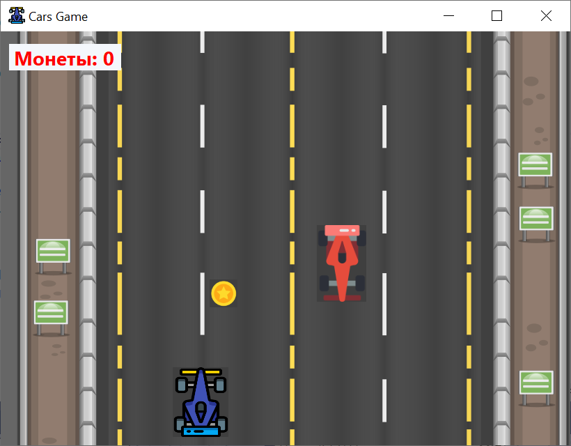
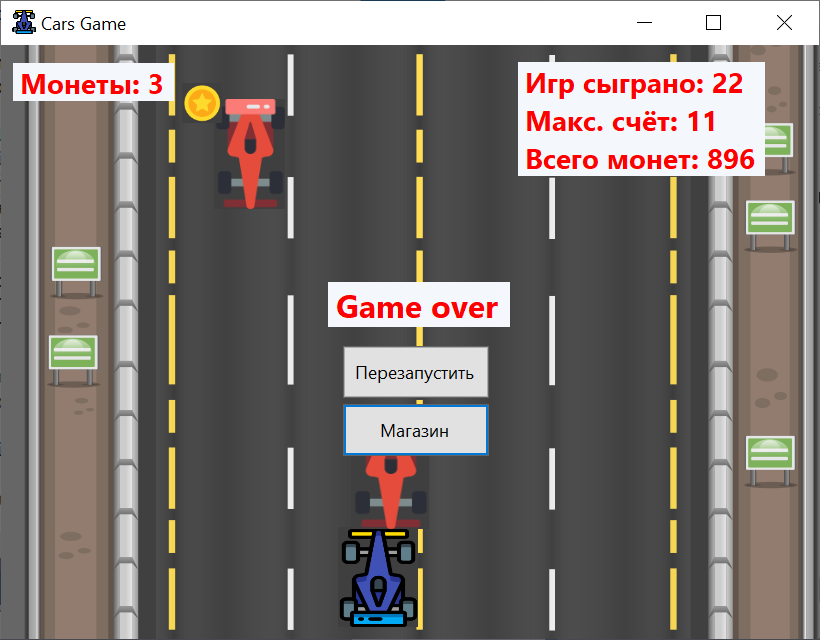
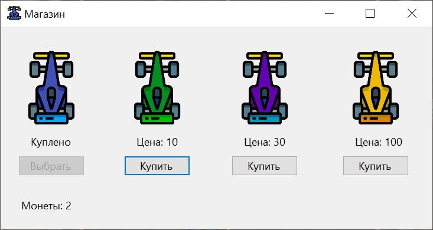

# CarGame

C# игра с машинками, сделанная с помощью Windows Forms.

> В основу игры лёг курс от сайта ItProger ([ссылка на плейлист на YouTube](https://www.youtube.com/playlist?list=PL0lO_mIqDDFWdwhHdoo66yGqrSzg95Bde)).

## Описание игры

Вы играете за автомобиль. Необходимо уклоняться от встречных машин и по дороге собирать монетки. В игре ведётся статистика сыгранных игр. Также есть магазин, в котором можно потратить монетки.

## Как скачать и запустить

Перейдите в папку `CarGame/build` и скачайте папку `build` целиком. В папке есть файл `CarGame.exe`, с помощью которого запускается игра.

> У вас должна быть установлена платформа `.Net`. 
> Ссылка на скачивание платформы: [https://dotnet.microsoft.com/en-us/download/dotnet-framework](https://dotnet.microsoft.com/en-us/download/dotnet-framework)

## Скриншоты

